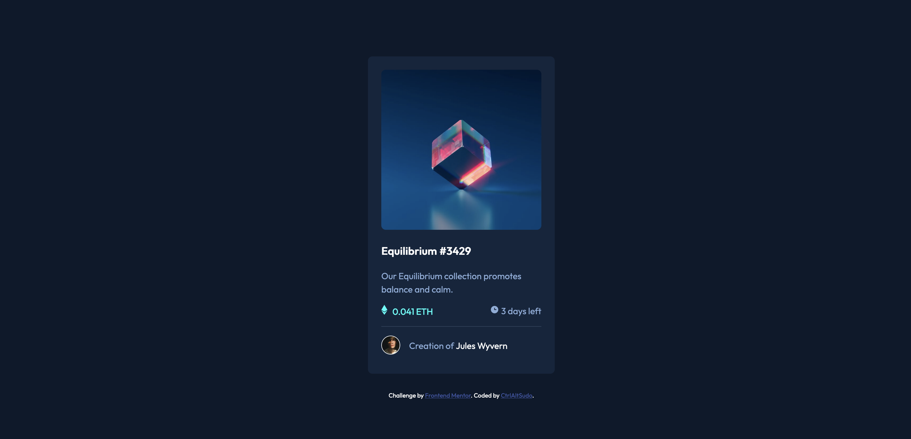

<h1 align="center">nft preview card component main</h1>

 <a align="center" href="https://ctrlaltsudo.github.io/nft-preview-card-component-main/">Live Demo</a>

 <a align="center" href="https://www.frontendmentor.io/solutions/nft-preview-card-component-main-fyG9IbqACa">Solution Page</a>

<h2 align="center">Project Screenshot<h2>

  </img>

## Description

This is a Frontend Mentor challenge, click the link above to visit the challenge page. 

## Built with 

HTML

CSS

Flexbox

## What I learnt 
I was avoiding this specific challenge as I don't want to participate in the NTF/Crypo space but I wanted a fairly easy challenge.

## Authors

<a href="https://github.com/CtrlAltSudo">CtrlAltSudo</a>.

## Acknowledgments 

Stack overflow, Google and ChatGPT still prove to be valuable resources! 